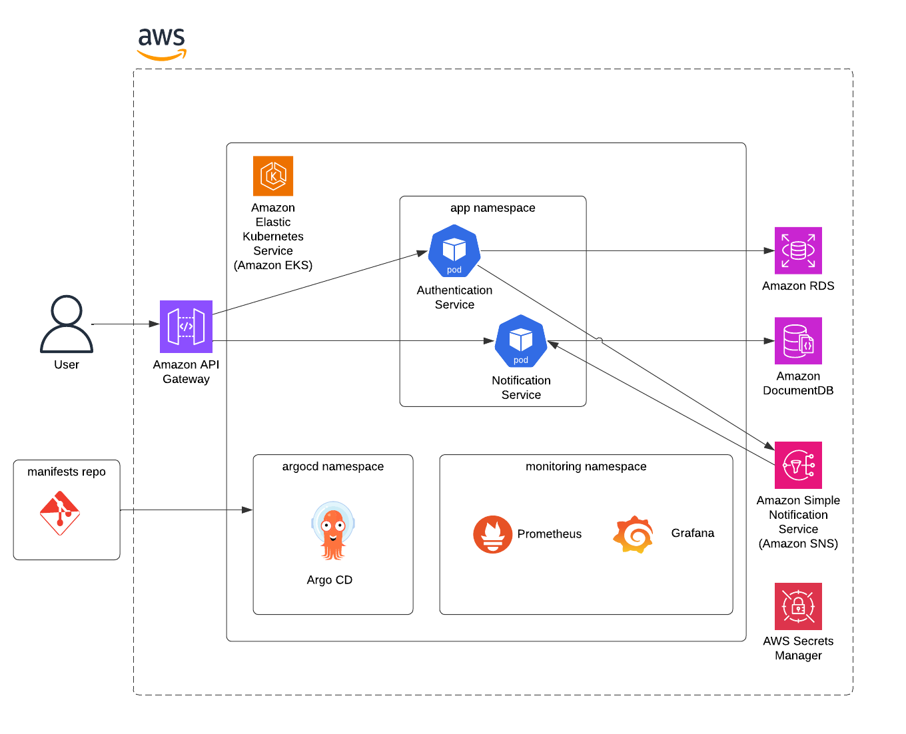

# AWS Microservices Deployment with EKS and GitOps
## Overview

This project demonstrates a modern, cloud-native architecture deployed on **Amazon Web Services (AWS)**. It showcases how to manage, deploy, and monitor containerized microservices using:

- **Amazon EKS** for Kubernetes orchestration
- **ArgoCD** for GitOps-driven deployment
- **Amazon API Gateway** for exposing APIs externally
- **Amazon RDS** and **Amazon DocumentDB**
- **Amazon SNS (Simple Notification Service)** for asynchronous communication
- **Prometheus and Grafana** for monitoring
- **AWS Secrets Manager** for managing secrets

---

## Architecture Diagram

---

## Microservices Overview

| Service              | Description                                      | Backend Storage           | Repository                                              |
|----------------------|--------------------------------------------------|----------------------------|----------------------------------------------------------|
| **Auth Service**      | Handles user authentication & JWT generation     | Amazon RDS (PostgreSQL)    | [auth-api](https://github.com/eyadarouaz/auth-api)       |
| **Notification Service** | Sends email/push notifications                  | Amazon DocumentDB          | [notification-api](https://github.com/eyadarouaz/notification-api) |

The services communicate asynchronously via **Amazon SNS**.

---

## Kubernetes Manifests

This repository is used by ArgoCD to continuously sync and deploy changes to the EKS cluster, following a fully declarative model.

**Repository**: [manifests](https://github.com/eyadarouaz/manifests-auth-app)

---

## Deployment Strategy

This project uses a **GitOps** approach:

1. Developer pushes code/manifests to GitHub
2. ArgoCD (running in EKS) watches Git and applies changes
3. Services are automatically updated in the EKS cluster
4. API Gateway routes requests to the appropriate service
5. Services authenticate securely using stored secrets
6. Prometheus scrapes metrics and Grafana visualizes them
   
